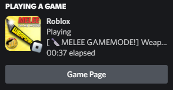
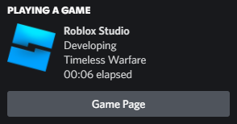
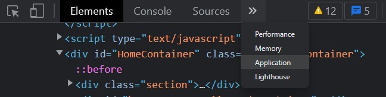
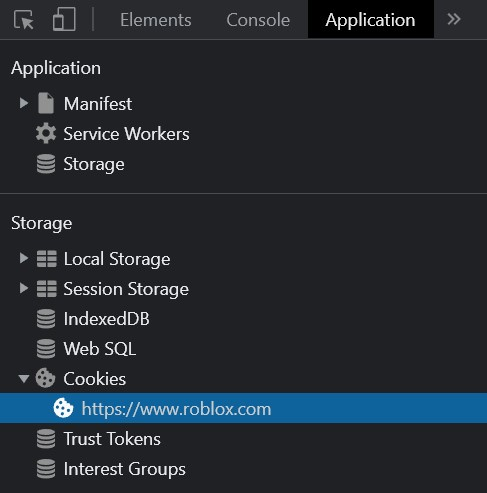
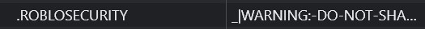

# StatEye :eye_speech_bubble:

An eye that keeps track of what you do on Roblox and shares it with others.

 

Roblox presence for Discord with only one native standalone executable that relies on zero external dependencies, and doesn't need to be installed.

## Performance :zap:

| Executable Size | Memory Usage     | Network Usage     | Disk Usage | CPU Usage |
|-----------------|------------------|-------------------|------------|-----------|
| ~1.5MB          | ~1.5MB to ~2.1MB | 0MB/s to ~0.1MB/s | 0%         | 0%        |

*0% does **NOT** imply that the program is not utilizing the given resource, but rather indicate that the usage is too low to be represented by one decimal place percentage.*

## Installation :building_construction:

- Download the `stateye.exe` file from the latest release.
- Create a file called `stateye.config` and place it in the same dictionary where `stateye.exe` is located.
- Open `stateye.config` in a notepad or other text editing program and paste the following:

```txt
token=
website=true
player=true
studio=true
```

- Go to <https://www.roblox.com/home/> and open inspect element.

- Go to the `Application` tab.



- Go to the `Cookies` and click on a url.



- Find `.ROBLOSECURITY` key and copy its value.



- Paste the value after the `token=`. **Do not put any spaces after `token=` or make a new line after pasting the token**.

eg. (make sure to include the full token, this is just an example).

```txt
token=_|WARNING:-DO-NOT-SHARE-THIS.
website=true
player=true
studio=true
```

## Configuration File :gear:

Format: `key=value`.

|   Key   | Description                                                                  | Value Type | Default Value |
|:-------:|------------------------------------------------------------------------------|:----------:|:-------------:|
|  token  | Roblox account token which can be found in a cookie called `.ROBLOSECURITY`. |  `string`  |               |
| website | Whether to show that you are online.                                         |   `bool`   |     `true`    |
|  player | Whether to show that you are playing a game.                                 |   `bool`   |     `true`    |
|  studio | Whether to show that you are developing a game.                              |   `bool`   |     `true`    |

> :warning: Do **NOT** share the token with anyone, keep it safe as it will allow bad actor to bypass all security features and access your account!

## Reporting Bugs :bug:

1. Download `stateye_debug.exe` from the latest release.
2. Start screen recording.
3. Obtain logs generated by the program, you can do that by running the program with the following cmd command: `powershell ".\stateye_debug.exe | tee logs.txt"`, make sure that you opened the cmd in the same place where the executable is located at.
4. Do something to cause problems and then exit out of the program if it didn't already.
5. Stop screen recording.
6. Remove sensitive details from `logs.txt` and the screen recording.
7. Open new issue and attach `logs.txt` with a screen recording along with details, such as what operating system you're using, etc.
